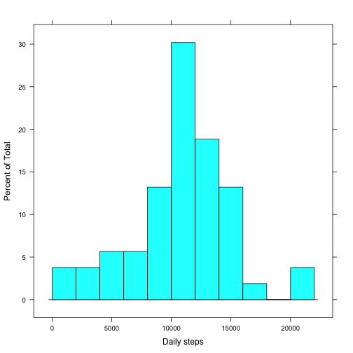

The goal of this study is to explore the data recorded on the number of steps taken
by an individual. The data consists in a compressed CSV file with three columns:

* The number of steps
* The day, in ISO 8601 (YYYY-MM-DD) format
* The 5-minute interval in the day, given as `HHMM` (e.g. `0535` means 05:35)

## Loading and preprocessing the data

To load the data we use R's facility for dealing with compressed files directly,
and convert it to a data frame:


```r
raw.file <- unz("activity.zip", "activity.csv")
steps <- read.csv(raw.file)
summary(steps)
```

```
##      steps                date          interval     
##  Min.   :  0.00   2012-10-01:  288   Min.   :   0.0  
##  1st Qu.:  0.00   2012-10-02:  288   1st Qu.: 588.8  
##  Median :  0.00   2012-10-03:  288   Median :1177.5  
##  Mean   : 37.38   2012-10-04:  288   Mean   :1177.5  
##  3rd Qu.: 12.00   2012-10-05:  288   3rd Qu.:1766.2  
##  Max.   :806.00   2012-10-06:  288   Max.   :2355.0  
##  NA's   :2304     (Other)   :15840
```


## What is mean total number of steps taken per day?

We compute the total number of steps for each day. This will also yield the mean and median
number of steps:


```r
steps.by.day <- aggregate(steps ~ date, steps, sum)
summary(steps.by.day)
```

```
##          date        steps      
##  2012-10-02: 1   Min.   :   41  
##  2012-10-03: 1   1st Qu.: 8841  
##  2012-10-04: 1   Median :10765  
##  2012-10-05: 1   Mean   :10766  
##  2012-10-06: 1   3rd Qu.:13294  
##  2012-10-07: 1   Max.   :21194  
##  (Other)   :47
```

And now we histogram them:


```r
library(lattice)
histogram(~ steps, 
          steps.by.day, 
          breaks = seq(0, 22000, 2000),
          xlab = "Daily steps")
```

 

## What is the average daily activity pattern?

To answer this question we use `aggregate` again, but this time taking the mean of the 
number of steps:


```r
steps.by.interval <- aggregate(steps ~ interval, steps, mean)
summary(steps.by.interval)
```

```
##     interval          steps        
##  Min.   :   0.0   Min.   :  0.000  
##  1st Qu.: 588.8   1st Qu.:  2.486  
##  Median :1177.5   Median : 34.113  
##  Mean   :1177.5   Mean   : 37.383  
##  3rd Qu.:1766.2   3rd Qu.: 52.835  
##  Max.   :2355.0   Max.   :206.170
```

We plot the mean number of steps for each 5-minute interval:


```r
xyplot(steps ~ interval,
       steps.by.interval,
       type = "l",
       grid = TRUE,
       xlab = "5-minute interval",
       ylab = "Mean number of steps")
```

 

The interval with the highest average number of steps can be found like this:


```r
steps.by.interval[which.max(steps.by.interval$steps),]
```

```
##     interval    steps
## 104      835 206.1698
```


## Inputting missing values

Let's fist check how many missing values there are:


```r
sum(is.na(steps$steps))
```

```
## [1] 2304
```

For each interval with missing data, we fill the missing values by looking up, from `steps.by.interval`, the mean number of steps
corresponding to that interval:


```r
steps.filled <- within(steps, {
  missing <- is.na(steps)
  steps[missing] <- steps.by.interval[match(interval[missing],
                                            steps.by.interval$interval),]$steps
  rm(missing)
})
summary(steps.filled)
```

```
##      steps                date          interval     
##  Min.   :  0.00   2012-10-01:  288   Min.   :   0.0  
##  1st Qu.:  0.00   2012-10-02:  288   1st Qu.: 588.8  
##  Median :  0.00   2012-10-03:  288   Median :1177.5  
##  Mean   : 37.38   2012-10-04:  288   Mean   :1177.5  
##  3rd Qu.: 27.00   2012-10-05:  288   3rd Qu.:1766.2  
##  Max.   :806.00   2012-10-06:  288   Max.   :2355.0  
##                   (Other)   :15840
```

As above, we compute the daily statistics:


```r
steps.filled.by.day <- aggregate(steps ~ date, steps.filled, sum)
summary(steps.filled.by.day)
```

```
##          date        steps      
##  2012-10-01: 1   Min.   :   41  
##  2012-10-02: 1   1st Qu.: 9819  
##  2012-10-03: 1   Median :10766  
##  2012-10-04: 1   Mean   :10766  
##  2012-10-05: 1   3rd Qu.:12811  
##  2012-10-06: 1   Max.   :21194  
##  (Other)   :55
```

There are no significant differences between the filled-in data frame and the original one.
Let's now plot it again:


```r
histogram(~ steps,
          steps.filled.by.day,
          breaks = seq(0, 22000, 2000),
          xlab = "Daily steps")
```

 

## Are there differences in activity patterns between weekdays and weekends?

First we augment the filled-in data frame with a factor, stating whether the day
was a normal working day or a weekend day:


```r
steps.filled <- within(steps.filled, {
  weekday <- weekdays(as.POSIXct(date))
  type <- factor(ifelse(weekday %in% c("Sunday", "Saturday"),
                        "Weekend",
                        "Weekday"))
  rm(weekday)
})
summary(steps.filled)
```

```
##      steps                date          interval           type      
##  Min.   :  0.00   2012-10-01:  288   Min.   :   0.0   Weekday:12960  
##  1st Qu.:  0.00   2012-10-02:  288   1st Qu.: 588.8   Weekend: 4608  
##  Median :  0.00   2012-10-03:  288   Median :1177.5                  
##  Mean   : 37.38   2012-10-04:  288   Mean   :1177.5                  
##  3rd Qu.: 27.00   2012-10-05:  288   3rd Qu.:1766.2                  
##  Max.   :806.00   2012-10-06:  288   Max.   :2355.0                  
##                   (Other)   :15840
```

Then we compute the mean number of steps, distinguishing between weekend days
and normal days:


```r
steps.filled.by.interval.and.type <- aggregate(steps ~ interval + type,
                                               steps.filled,
                                               mean)
summary(steps.filled.by.interval.and.type)
```

```
##     interval           type         steps        
##  Min.   :   0.0   Weekday:288   Min.   :  0.000  
##  1st Qu.: 588.8   Weekend:288   1st Qu.:  2.047  
##  Median :1177.5                 Median : 28.133  
##  Mean   :1177.5                 Mean   : 38.988  
##  3rd Qu.:1766.2                 3rd Qu.: 61.263  
##  Max.   :2355.0                 Max.   :230.378
```

And finally we plot the two series:


```r
xyplot(steps ~ interval | type,
       steps.filled.by.interval.and.type,
       type = "l",
       grid = TRUE,
       layout = c(1, 2),
       xlab = "Interval",
       ylab = "Mean number of steps")
```

 

It is obvious that this person tends to walk more in the morning between 5 and 10 am on normal days than on the weekend.
